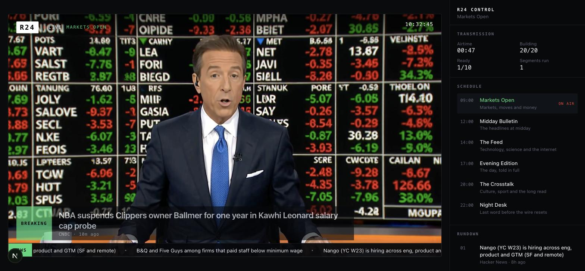
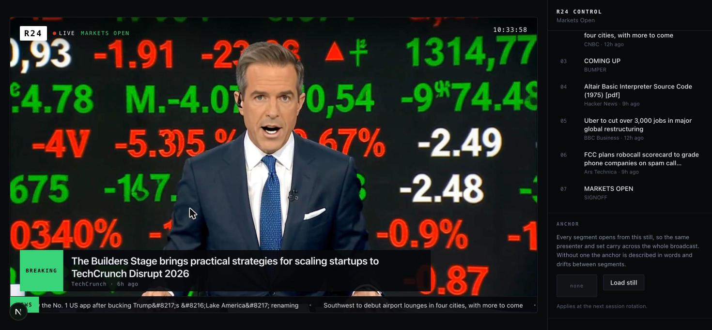

# R24 — a news channel that generates itself

A continuous, generated news broadcast. Live wire copy and grounded web search
go in; a lip-synced anchor with native audio comes out, segment after segment,
cutting to footage, throwing to correspondents on location, and answering
viewers by name — on a schedule, without stopping.



Everything on screen was generated seconds earlier from a story that reached the
wire minutes before that. The anchor, the studio, the correspondent standing
outside a building in another country, the voice — none of it is stock, and none
of it is pre-rendered.

---

## Why this is interesting

Generating one talking-head clip is a solved demo. Running a **channel** is a
different problem, and almost all of the code here is about the gap:

- something must be on screen **at all times**, so the next segment has to be
  built before the current one ends;
- a bulletin has **shape** — a story worth twenty seconds and a story worth
  ninety are not the same story, and something has to decide which is which;
- clips share **no memory**, so every prompt re-establishes the world from
  nothing inside an 800-character cap;
- and it has to survive dead feeds, failed generations, session limits and
  people closing tabs, without ever going to black.

---

## What it does

**Reads the wire, and searches the web.** Seventeen public RSS feeds — BBC,
Guardian, NPR, Al Jazeera, NYT, CNBC, Bloomberg, TechCrunch, Sifted, Hacker
News, Ars Technica and more — deduped across outlets so four papers running one
story produce one segment. On top of that, every block runs a **grounded Google
search** through Gemini, because RSS is only as current as its publishers' feeds
and a funding round reaches them hours late or never.

**Runs a newsroom.** A producer model (`gemini-flash-lite`) is handed the block's
stories and decides what each one is worth:

| Treatment | Shape | Length |
|---|---|---|
| `short` | anchor reads it, maybe one picture | ~20s |
| `medium` | anchor introduces it, one or two cutaways carry it | ~32s |
| `long` | opens on an aerial, several cutaways, a correspondent on location, anchor tags it out | ~75s |

It writes the anchor's copy, the shot list, the line spoken over each picture,
and — for the stories that warrant it — where a correspondent is standing and
what they say.

**Cuts to real pictures.** A cutaway starts from the publisher's own photograph
where there is one, pulled from `media:content` or the article's `og:image`, so
the footage develops out of a real press photo of the actual company rather than
a generic library shot.



**Answers its audience.** Anyone watching can comment. Between every story the
anchor turns to camera and says something about one — by name, in their own
words, tied to a headline the channel has actually run. Every comment gets a
line; there is no queue of ignored ones.

**Follows a schedule.** Eight dayparts, each rotating ten-minute strands —
Startup Desk, Bulletin, Screen Desk, Markets, The Feed, Courtside. The channel
opens on the startup desk whatever the clock says, then joins the wheel.

**Serves one broadcast to everyone.** The first person through the door creates
the GPU session; everyone after attaches to that same session and watches the
same frame. Ten viewers cost exactly what one does.

---

## Quick start

```bash
git clone https://github.com/sachin1705s/news-studio
cd news-studio
npm install

cp .env.example .env.local     # add your keys
npm run dev
```

Open <http://localhost:3000>. If nothing is broadcasting, the channel starts one
and you'll wait ~25 seconds for the first clip; if one is already running, you
join it in about ten.

### Read this before you run it

**Generation is billed per GPU-second, and it is not cheap.**

| | |
|---|---|
| FastH3 rate | 70 credits/sec — **$0.42 / minute** |
| One hour on air | **$25.20** |
| Literal 24/7 | **~$605 / day** |

The meter starts the moment a session reaches `ready` and runs until it
terminates — **idle or not**, because you are paying for the GPU rather than for
the generation. `connecting` and `waiting` are free.

Three things guard your account, and you should understand all of them:

- **One session, ever.** The token route asks Reactor what is already running
  and refuses to mint an origin token while any session is open. It is enforced
  server-side, not in the browser.
- **It stops when nobody is watching.** Presence is a heartbeat; ninety seconds
  of an empty room and the channel releases the GPU.
- **A hard session cap.** Sessions are minted with a one-hour ceiling so a
  crashed tab or a closed laptop cannot bill for a day.

Even so: treat 24/7 as the design target, not an instruction to leave it
running. `CHANNEL_OFF=1` refuses every origin token if you need a kill switch.

### Configuration

| Variable | Required | Effect |
|---|---|---|
| `REACTOR_API_KEY` | **yes** | Server-side only, exchanged for a scoped JWT. From [reactor.inc](https://reactor.inc). |
| `GEMINI_API_KEY` | **yes** | The newsroom: story treatments, anchor copy, shot lists, correspondents, and the replies to viewers. |
| `KV_REST_API_URL` / `KV_REST_API_TOKEN` | recommended | Redis for comments, presence, the channel registry and broadcast history. Without it these fall back to per-instance memory and forget on cold start. |
| `OPS_SECRET` | optional | Unlocks the operator panel at `?ops=<secret>`: live credit balance, burn rate, and a stop button. |
| `CHANNEL_OFF` | optional | Set to `1` to refuse all origin tokens. |
| `REACTOR_MAX_SESSION_SECONDS` | optional | Hard cap on a single session. Default `3600`. |

---

## How it works

### Keeping something on screen

FastH3 exposes two queues — clips being **generated**, and built clips waiting to
**play** — and the client owns playback order. The channel turns autoplay on and
keeps the generation queue fed, so a built clip is always waiting when the
current one ends. `set_flush_on_clip_end(false)` holds the last frame between
segments instead of flashing to black.

It deliberately commits only about **ninety seconds ahead**. Filling all twenty
slots decides the next three minutes before a viewer has finished typing, and
leaves nowhere to slot a reply in. A shallow queue is what lets the anchor turn
to the audience *between* stories instead of interrupting one.

### One session, many viewers

Reactor supports several WebRTC connections on a single session, which is what
makes this a channel rather than a per-visitor render farm.

```
origin browser ── creates session ──┐
                                    ├── one GPU, one bill
viewer, viewer, viewer ── adopt ────┘
```

A viewer gets a token scoped with `resources.sessions.bind` naming that one
session: it can attach to the broadcast and **cannot start another**. An
adopting client tears down only its own connection when it leaves, so viewers
come and go without disturbing the broadcast.

### Writing the prompts

Four modes, because clips share no memory and each prompt must re-establish
everything:

- **Anchor, with a still** — the still carries the set, so the prompt spends its
  characters on motion and sound.
- **Anchor, without one** — has to describe the whole studio every time.
- **Cutaway** — states plainly that *no presenter is on screen* and the anchor is
  heard over the footage. Handed a news script and no such instruction, the model
  puts a presenter back in frame.
- **Correspondent** — a person on location holding a microphone, with the place
  audible behind them.

The script is fitted to the clip rather than the clip to the script — roughly 2.3
words per second, less head and tail. Context sentences are spoken whole or
dropped whole, because half a sentence cut off at a clip boundary sounds like a
dropped feed. Trims are clause-aware and never land on a dangling preposition.

### Not repeating itself

Nothing goes to air that echoes a line already spoken in the same package —
checked by content-word overlap, not string distance, so "Adobe acquires Rilo"
and "Adobe has acquired the AI startup Rilo" are correctly caught as the same
sentence. Stories are retired for six hours, in a history that lives on the
server rather than in a browser, so a restart doesn't replay the bulletin.

---

## Make it your own channel

Nothing here is specific to a startups-and-technology bulletin. Six files
decide what kind of channel this is, and none of them require touching the
streaming machinery.

### Change the subject

**`lib/feeds.ts`** — the wire. Add or replace RSS sources under a category.
Each one was checked for a `200` and a parseable `<item>` list before it went
in; do the same, because a feed that 404s silently narrows your bulletin.

```ts
sport: [
  { url: "https://www.theguardian.com/uk/sport/rss", source: "Guardian Sport" },
],
```

**`lib/strands.ts`** — the ten-minute blocks. A strand says which categories it
pulls, what its lower-third kicker reads, how the anchor hands into it, what
its footage should look like, and what it searches the web for. This is the
highest-leverage file in the repo: a new strand is a new programme.

```ts
courtside: {
  name: "Courtside",
  categories: ["sport"],
  kicker: "SPORT",
  intro: "Now the sport.",
  lookFor: "stadiums, arenas, training grounds, crowds",
  searchAngles: ["football transfer news and signings", "…"],
},
```

**`lib/programs.ts`** — the 24-hour wheel. Eight dayparts, each with its own
set, lighting, music bed, anchor register, strap line, accent colour, and the
strands it rotates through. *Markets Open* at 9am reads clipped and fast in a
room full of ticker boards; *Night Desk* at 10pm reads quiet and close in a
single pool of light. Editing this array changes the schedule and the on-screen
rail follows.

### Change the editorial voice

**`app/api/newsroom/route.ts`** — the producer's brief. This is where the
channel's judgement lives: what makes a story worth twenty seconds versus
ninety, how long a read runs, when a correspondent gets sent, what a cutaway
may and may not show. It is a plain-English prompt; rewrite it and you have a
different newsroom.

**`app/api/reply/route.ts`** — how the anchor treats the audience. Currently:
answer everyone, name them, tie it to a headline actually broadcast, and handle
abuse by acknowledging the person without dignifying the content.

**`lib/prompt.ts`** — how a segment becomes a shot. The anchor's voice and
language, the clip-length tiers, the word budget, and the four prompt modes.
Change `VOICE` and your anchor sounds like somewhere else.

### Change the identity

**`lib/pinned.ts`** — the story the channel opens on, so a first-time viewer
lands somewhere deliberate instead of mid-block. Set it to your own
announcement or delete it.

**The anchor still** — load a 16:9 studio photo and it is uploaded once per
session and passed as `starting_frame` on every anchor clip, so the same
presenter fronts every segment. Without one the anchor is described in words
against a pinned seed: recognisable in register, but the face drifts.

### A worked example

A cricket channel, end to end:

1. Add a cricket feed to `lib/feeds.ts` under `sport`.
2. Add a `cricket` strand in `lib/strands.ts` — `lookFor` of "nets, pitches,
   packed stands, players walking out", `searchAngles` for scores and squads.
3. Put `cricket` in the strand rotation of whichever dayparts should carry it.
4. Point `OPENING_STRAND` at it so the channel opens there.
5. In the producer brief, say what a cricket story worth ninety seconds looks
   like.

No changes to the queue, the session handling, or the prompts.

---

## Project structure

```
lib/feeds.ts        RSS sources by category (each verified live)
lib/programs.ts     the 24h daypart wheel
lib/strands.ts      10-minute blocks, and what each searches the web for
lib/newsroom.ts     what the producer returns: treatments, cuts, correspondents
lib/rundown.ts      stories -> ordered segments and packages, with repeat guards
lib/prompt.ts       segments -> FastH3 prompts, inside the 800-char cap
lib/reactor-sessions.ts   listing and terminating sessions (auth is fiddly)
lib/store.ts        Redis, with a memory fallback

components/Deck.tsx       the origin session, the producer loop, the queue
components/Broadcast.tsx  roles, presence, the registry, the chrome

app/api/newsroom    the producer: Gemini writes the block
app/api/wire        grounded web search for what RSS misses
app/api/reply       the anchor's answer to a viewer
app/api/image       the publisher's photo, for cutaway starting frames
app/api/channel     which session the channel is broadcasting from
app/api/community   comments
app/api/presence    who is watching
app/api/reactor/token   scoped fast-h3 JWTs, server-side only
```

---

## Notes for anyone building on FastH3

Things that cost real time to find out:

- **Pass the JWT as a string, not a resolver.** The SDK calls a resolver before
  every authenticated request, so one that can return a *different* token
  mid-session hands the SDK a credential that did not create the session. It is
  then not authorized for it: termination returns 403, the session leaks and
  keeps billing, and the connection churns `ready → disconnected → connecting`
  with nothing on screen.
- **`max_sessions` counts sessions a token has *ever* created**, not how many at
  once. A cached token with `max_sessions: 1` works for exactly one broadcast and
  then refuses every restart.
- **Building first is not playing first.** A clip enqueued at `position: 0`
  builds next but still joins the *back* of the playout queue. Jumping the queue
  takes both: `enqueue({position: 0})` and then `move({position: 0})` on
  `clip_generated`.
- **`get_state` never resolves a value.** Its answer is the `state_update`
  *broadcast*, which reaches every client rather than the caller, so
  `sendCommand` has nothing caller-scoped to resolve. Gate on
  `status === "ready"` instead.
- **`set_canvas` is idle-gated.** Set the aspect before anything is queued.
- **`set_clip_seconds` replies with `clip_seconds`**, not `seconds`.
- **`metadata` is echoed back on every message about a clip.** Put your display
  text in it and drive the on-screen chrome from `clip_started`, never from a
  parallel timer — then the caption cannot drift out of sync with the picture.
- **Video models render lettering as nonsense.** A scoreboard came back reading
  `PTANYA / ANN INFPS`. A stronger "no text" instruction does not fix it, because
  the instruction loses to the subject; the producer is barred from *choosing*
  text-bearing subjects at all.
- **Name the language in the speaker tag.** The checkpoint's training format
  carries explicit language tags and it will drift into another language,
  hardest when a story is set abroad. A bracketed `[English]` is ignored at wire
  length — `S1 (the anchor, English, neutral broadcast accent)` is not.
- **Listing and terminating sessions is possible**, though undocumented:
  `GET /accounts/{id}/sessions` with the `Reactor-API-Key` header, and
  `DELETE /sessions/{id}` with `Authorization: Bearer <api key>` — the API-key
  header returns 401 there and a JWT returns 403.

---

## Built on

[**Reactor**](https://reactor.inc) — FastH3, which generates picture and sound in
a single pass. That is the whole reason this works: the anchor's lip sync is not
a post-process, and the room tone under a correspondent is generated with the
shot rather than mixed under it.

Gemini writes the newsroom. Next.js, Redis, and a lot of public RSS do the rest.

## Licence

MIT.
